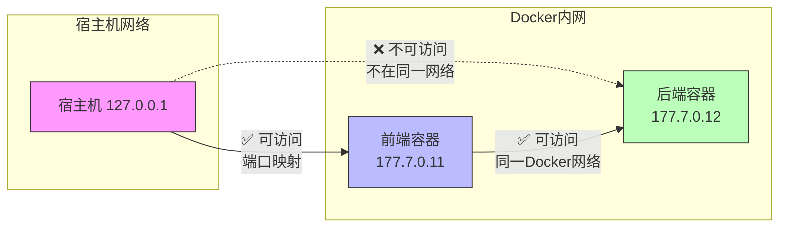
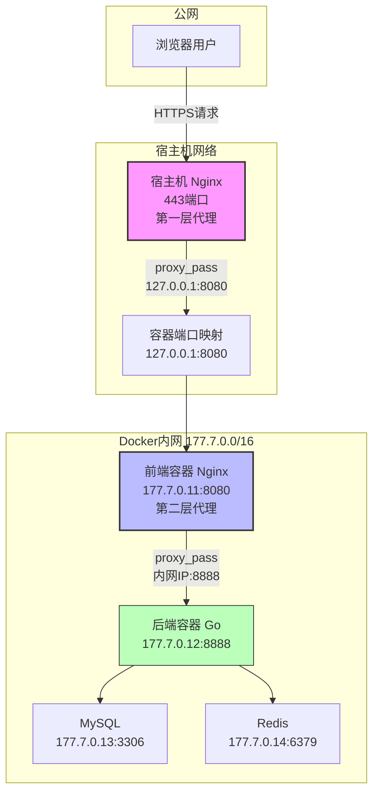
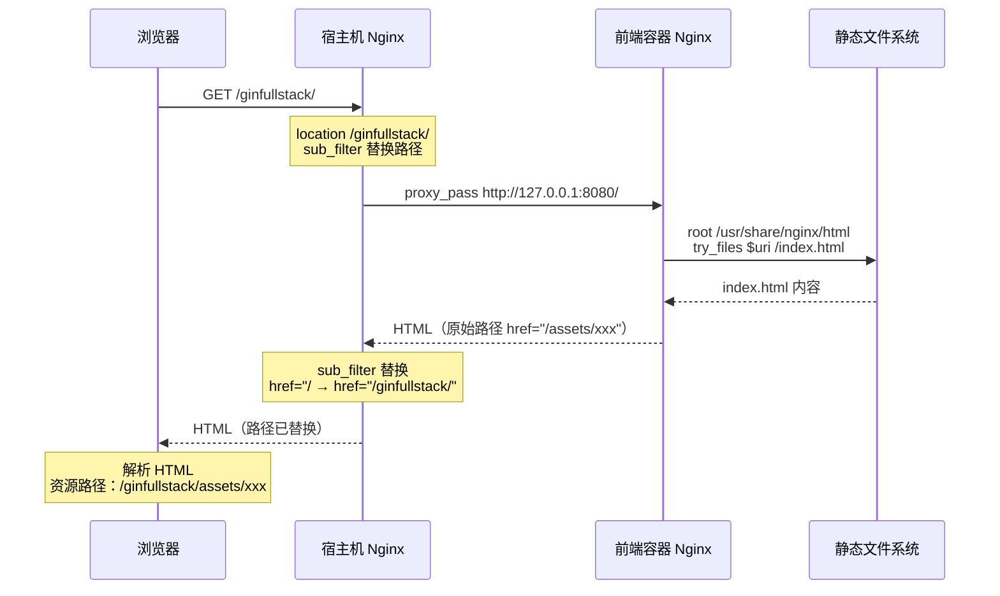
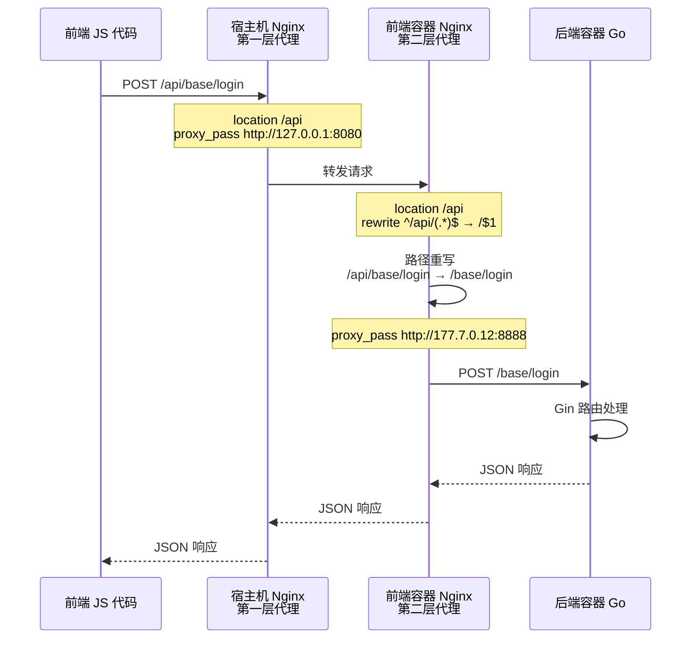
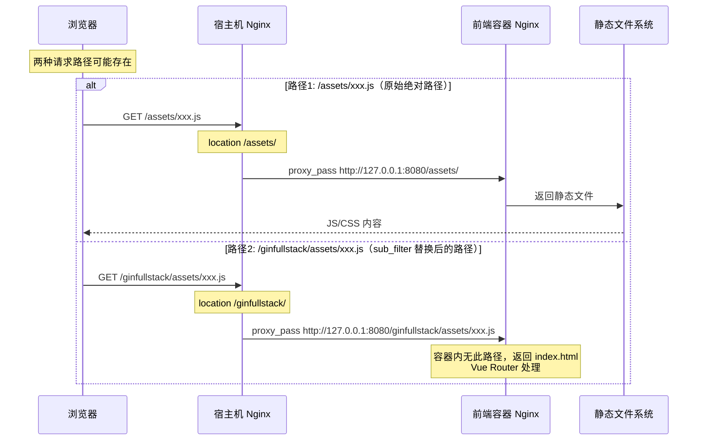
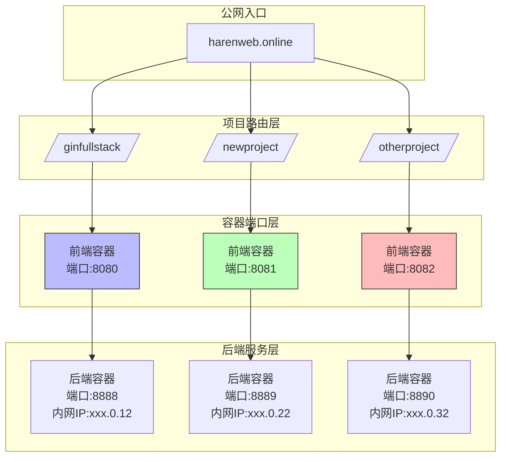

# Gin-Vue-Admin 部署架构文档

本文档记录 Gin-Vue-Admin 项目的 Docker 部署架构，重点说明「双重代理」工作模式及多项目挂载注意事项。

---

## 1. 概述

本项目采用 Docker 容器化部署，使用「双重代理」架构实现公网访问。

### 1.1 容器网络拓扑

| 容器 | 端口映射 | Docker 内网 IP | 说明 |
|------|----------|---------------|------|
| gva-web | 8080:8080 | 177.7.0.11 | 前端容器（唯一暴露到宿主机） |
| gva-server | 无 | 177.7.0.12 | 后端容器（不暴露，仅内网通信） |
| gva-mysql | 无 | 177.7.0.13 | 数据库（不暴露） |
| gva-redis | 无 | 177.7.0.14 | 缓存（不暴露） |

### 1.2 网络访问权限



---

## 2. 双重代理工作模式

### 2.1 架构总览



### 2.2 两层代理配置对照

#### 第一层代理：宿主机 Nginx

**文件位置**：`/etc/nginx/sites-available/harenweb`

**功能**：接收公网请求，转发到前端容器暴露端口

```nginx
# API 请求处理
location /api {
    proxy_pass http://127.0.0.1:8080;  # 转发到前端容器暴露端口
    proxy_set_header Host $host;
    proxy_set_header X-Real-IP $remote_addr;
}
```

#### 第二层代理：前端容器 Nginx

**文件位置**：`web/.docker-compose/nginx/conf.d/my.conf`

**功能**：接收宿主机请求，转发到后端容器内网 IP

```nginx
# API 代理到后端
location /api {
    proxy_set_header Host $http_host;
    rewrite ^/api/(.*)$ /$1 break;      # 重写路径：移除 /api 前缀
    proxy_pass http://177.7.0.12:8888;  # 转发到后端容器内网 IP
}
```

### 2.3 为什么需要双重代理？

| 网络层级 | 可访问性 | 原因 |
|----------|----------|------|
| 宿主机 → 容器暴露端口 (8080) | ✅ 可达 | Docker 端口映射机制 |
| 宿主机 → Docker 内网 IP (177.7.0.12) | ❌ 不可达 | 宿主机不在 Docker 虚拟网络中 |
| 前端容器 → 后端容器内网 IP | ✅ 可达 | 两个容器在同一 Docker 网络中 |

**核心原因**：宿主机无法直接访问 Docker 内网 IP，必须通过「已暴露端口的前端容器」作为中间代理。

### 2.4 双重代理 vs 单一代理对比

| 对比项 | 双重代理（当前方案） | 单一代理（暴露后端端口） |
|------|---------------------|------------------------|
| 延迟 | 多一次代理转发（约+1ms） | 少一次代理转发 |
| 安全性 | ✅ 后端不暴露到公网 | ❌ 后端直接暴露，有安全风险 |
| 配置复杂度 | 无需修改 docker-compose | 需修改 docker-compose 暴露端口 |
| 维护性 | 集中在宿主机 nginx | 需同时维护宿主机 nginx + docker-compose |
| 适用场景 | 前后端一体化部署 | 后端需要独立部署/被其他服务调用 |

---

## 3. 两类请求的处理方式

### 3.1 浏览器直接请求（页面请求）

用户访问 `https://harenweb.online/ginfullstack/`



**关键处理**：
- `sub_filter` 动态替换 HTML 中的绝对路径
- 原始路径 `href="/assets/xxx"` → 替换为 `href="/ginfullstack/assets/xxx"`

### 3.2 JS 发起的 API 请求

前端 JS 代码中硬编码的 API 调用：`POST /api/base/login`



**请求路径变换过程**：

```
原始请求：/api/base/login
    ↓ 宿主机 nginx proxy_pass（保持原路径）
到达前端容器：/api/base/login
    ↓ 前端容器 nginx rewrite（移除 /api 前缀）
到达后端容器：/base/login
    ↓ Gin 路由匹配
后端处理完成
```

### 3.3 静态资源请求处理

前端 JS 加载资源：`GET /assets/xxx.js` 或 `GET /ginfullstack/assets/xxx.js`



---

## 4. 多项目挂载冲突分析

### 4.1 当前项目占用的路径

| 路径 | 类型 | 冲突风险 | 说明 |
|------|------|----------|------|
| `/ginfullstack/` | 项目专属前缀 | ✅ 无冲突 | 该路径唯一属于本项目 |
| `/api/` | 前端 JS 硬编码 | ❌ **高风险** | 多个项目可能都使用 `/api` |
| `/assets/` | 前端 JS 硬编码 | ❌ **高风险** | 多个项目可能都使用 `/assets` |
| `/favicon.ico` | 绝对路径引用 | ⚠️ 中风险 | 浏览器默认请求 |
| `/logo.png` | 绝对路径引用 | ⚠️ 中风险 | 项目特定资源 |

### 4.2 冲突场景示例

假设在同一域名下添加新项目 `/newproject/`：

```mermaid
graph TB
    subgraph 宿主机Nginx路由
        API[/api/*]
        Assets[/assets/*]
        Ginfullstack[/ginfullstack/*]
        Newproject[/newproject/*]
    end
    
    subgraph 当前项目 ginfullstack
        GWeb[前端容器:8080]
        GBackend[后端容器:8888]
    end
    
    subgraph 新项目 newproject
        NWeb[前端容器:8081]
        NBackend[后端容器:8889]
    end
    
    API -->|已被捕获| GWeb
    Assets -->|已被捕获| GWeb
    Ginfullstack --> GWeb
    Newproject --> NWeb
    
    NWeb -.->|JS请求 /api/*<br/>被错误路由到| GWeb
    
    style API fill:#f66,stroke:#333
    style Assets fill:#f66,stroke:#333
    style NWeb fill:#fbb,stroke:#333
```

**问题**：新项目 `newproject` 的前端 JS 发起 `/api/xxx` 请求，但宿主机 nginx 的 `location /api` 已被 ginfullstack 项目捕获，导致请求被错误路由。

### 4.3 多项目推荐架构（端口隔离方案）



### 4.4 解决方案对比

| 方案 | 操作步骤 | 优点 | 缺点 |
|------|----------|------|------|
| **端口隔离** | 每个项目使用独立端口池（前端+后端） | ✅ 配置简单，无需修改前端代码 | ⚠️ 需管理多个端口 |
| **修改前端构建** | 修改 vite.config.js 的 `base` 配置，重新构建镜像 | ✅ 路径最正确，无冲突风险 | ⚠️ 构建耗时，需修改源码 |
| **nginx if 判断** | 根据 `$http_referer` 判断请求来源 | ❌ nginx if 配置复杂，不推荐 | 性能影响，维护困难 |

### 4.5 端口隔离配置示例

**docker-compose.yaml**（新项目）：

```yaml
services:
  web:
    ports:
      - '8081:8080'  # 使用不同端口
    networks:
      network:
        ipv4_address: 177.8.0.11  # 使用不同网段
  
  server:
    networks:
      network:
        ipv4_address: 177.8.0.12
```

**宿主机 nginx**：

```nginx
# ginfullstack 项目
location /ginfullstack/ {
    proxy_pass http://127.0.0.1:8080/;
}
location /api {
    # 需要配合请求头判断或使用不同API前缀
    proxy_pass http://127.0.0.1:8080;
}

# newproject 项目
location /newproject/ {
    proxy_pass http://127.0.0.1:8081/;
}
```

---

## 5. 配置文件汇总

### 5.1 宿主机 Nginx 关键配置

**文件位置**：`/etc/nginx/sites-available/harenweb`

```nginx
# HTTPS server
server {
    listen 443 ssl http2;
    server_name harenweb.online;

    # SSL 配置（Let's Encrypt）
    ssl_certificate /etc/letsencrypt/live/harenweb.online/fullchain.pem;
    ssl_certificate_key /etc/letsencrypt/live/harenweb.online/privkey.pem;

    # 前端页面（含路径替换）
    location /ginfullstack/ {
        proxy_pass http://127.0.0.1:8080/;
        proxy_set_header Host $host;
        proxy_set_header Accept-Encoding "";  # 禁用压缩以便 sub_filter
        
        # 动态替换 HTML 中的绝对路径
        sub_filter 'href="/' 'href="/ginfullstack/';
        sub_filter 'src="/' 'src="/ginfullstack/';
        sub_filter_once off;
        sub_filter_types text/html;
    }

    # API 请求（第一层代理）
    location /api {
        proxy_pass http://127.0.0.1:8080;  # 转发到前端容器
        proxy_set_header Host $host;
        proxy_set_header X-Real-IP $remote_addr;
    }

    # 静态资源（处理绝对路径）
    location /assets/ {
        proxy_pass http://127.0.0.1:8080/assets/;
    }
}
```

### 5.2 前端容器 Nginx 关键配置

**文件位置**：`web/.docker-compose/nginx/conf.d/my.conf`

```nginx
server {
    listen 8080;
    server_name localhost;

    # 静态文件服务
    location / {
        root /usr/share/nginx/html;
        try_files $uri $uri/ /index.html;
    }

    # API 代理（第二层代理）
    location /api {
        proxy_set_header Host $http_host;
        proxy_set_header X-Real-IP $remote_addr;
        proxy_set_header X-Forwarded-For $proxy_add_x_forwarded_for;
        
        # 重写路径：移除 /api 前缀
        rewrite ^/api/(.*)$ /$1 break;
        
        # 代理到后端容器内网 IP
        proxy_pass http://177.7.0.12:8888;
    }
}
```

### 5.3 Docker Compose 关键配置

**文件位置**：`deploy/docker-compose/docker-compose.yaml`

```yaml
networks:
  network:
    ipam:
      config:
        - subnet: '177.7.0.0/16'  # Docker 内网网段

services:
  web:
    ports:
      - '8080:8080'  # 暴露到宿主机（唯一暴露的端口）
    networks:
      network:
        ipv4_address: 177.7.0.11

  server:
    # 不暴露端口，仅通过 Docker 内网通信
    networks:
      network:
        ipv4_address: 177.7.0.12

  mysql:
    # 不暴露端口
    networks:
      network:
        ipv4_address: 177.7.0.13

  redis:
    # 不暴露端口
    networks:
      network:
        ipv4_address: 177.7.0.14
```

---

## 6. 公网访问地址

| 服务 | URL |
|------|-----|
| 前端界面 | https://harenweb.online/ginfullstack/ |
| API 请求 | https://harenweb.online/api/* |
| Swagger 文档 | https://harenweb.online/ginfullstack/swagger/index.html |

---

## 7. 部署命令参考

### 7.1 分阶段部署（防止内存溢出）

```bash
# 1. 添加 Swap（防止 OOM）
sudo fallocate -l 4G /swapfile
sudo chmod 600 /swapfile
sudo mkswap /swapfile
sudo swapon /swapfile

# 2. 分阶段构建镜像
cd /opt/gin-fullstack/deploy/docker-compose
docker compose pull mysql redis
docker compose build server
docker compose build web

# 3. 分阶段启动容器
docker compose up -d mysql redis
sleep 30  # 等待健康检查
docker compose up -d server
docker compose up -d web

# 4. 验证
docker compose ps
```

### 7.2 重新加载宿主机 Nginx

```bash
nginx -t && systemctl reload nginx
```

---

## 8. 问题排查指南

### 8.1 API 返回 404

**排查步骤**：

```bash
# 1. 测试后端容器是否正常运行
docker logs gva-server --tail=50

# 2. 测试前端容器能否访问后端内网 IP
docker exec gva-web curl -s http://177.7.0.12:8888/base/login -X POST -d '{}'

# 3. 测试宿主机能否访问前端容器
curl -s http://127.0.0.1:8080/api/base/login -X POST -d '{}'

# 4. 测试公网访问
curl -sk https://harenweb.online/api/base/login -X POST -d '{}'
```

### 8.2 静态资源加载失败

**排查步骤**：

```bash
# 1. 检查 HTML 中的路径是否被替换
curl -sk https://harenweb.online/ginfullstack/ | grep 'src=.*assets'

# 2. 测试静态资源路径
curl -sk https://harenweb.online/assets/xxx.js -I
curl -sk https://harenweb.online/ginfullstack/assets/xxx.js -I
```

---

## 9. 参考文档

- [Nginx sub_filter 官方文档](https://nginx.org/en/docs/http/ngx_http_sub_module.html)
- [Docker 网络配置官方文档](https://docs.docker.com/network/)
- [Vue Router Hash 模式文档](https://router.vuejs.org/guide/essentials/history-mode.html#hash-mode)