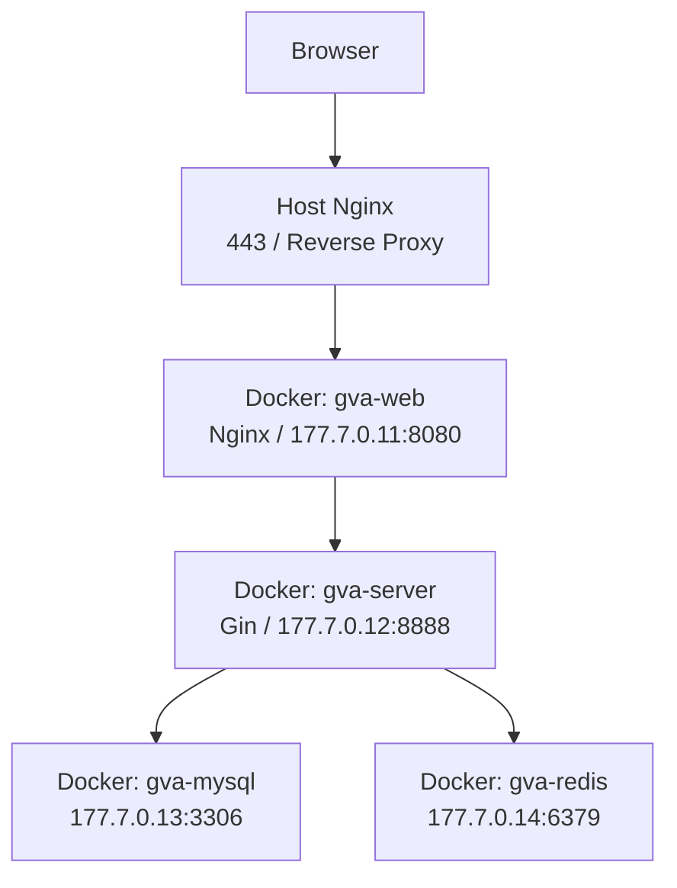

# Gin Fullstack

> 基于 `gin-vue-admin` 二次开发的校园服务平台 B 端项目。

## 项目简介

`Gin Fullstack` 是一个基于 `gin-vue-admin` 进行二次开发的后台管理平台，面向校园服务场景，定位为校园服务平台的 B 端管理系统。

项目在保留上游成熟后台能力的基础上，结合校园业务进行了定制化扩展，适合作为校内服务、运营管理、权限控制和业务配置的管理端基础平台。

- 基于现成的前后端分离后台框架进行二开
- 面向校园服务业务的 B 端管理场景
- 支持权限、角色、菜单、用户、接口等后台基础能力
- 采用 `Docker + Nginx` 的方式部署到线上环境

原始框架说明保存在 [README_OLD.md](./README_OLD.md)，当前文档聚焦本仓库二开版本的项目说明与部署方式。

## 在线体验

| 项目 | 地址 / 说明 |
| --- | --- |
| 在线地址 | [https://harenweb.online/ginfullstack](https://harenweb.online/ginfullstack) |
| 测试账号 | `Test1` |
| 测试密码 | `123456` |

## 项目定位

本项目并不是从零开始搭建的全新后台，而是基于 `gin-vue-admin` 的成熟能力进行二次开发，重点服务于校园业务场景下的 B 端平台建设。

适用方向包括：

- 校园服务后台管理
- 运营与配置管理平台
- 用户、角色、菜单、权限统一管理
- 基于现有后台骨架继续扩展业务模块

## 技术栈

| 层级 | 技术选型 |
| --- | --- |
| 前端 | `Vue 3`、`Vite 6`、`Element Plus`、`Pinia`、`Vue Router` |
| 后端 | `Go 1.24`、`Gin`、`Gorm`、`JWT`、`Casbin`、`Swagger` |
| 数据层 | `MySQL`、`Redis` |
| 部署 | `Docker`、`Docker Compose`、`Nginx` |
| 文档 | `README_OLD.md`、`DEPLOYMENT_ARCHITECTURE.md` |

## 核心能力

基于上游框架能力与当前项目定位，仓库具备以下后台平台基础能力：

- 用户管理：支持用户信息维护、账号管理与后台登录
- 角色权限管理：基于 `JWT + Casbin` 实现接口与菜单权限控制
- 动态菜单管理：支持不同角色配置不同菜单视图
- 接口管理：便于后端接口权限接入和统一控制
- 文件与资源管理：支持本地或对象存储扩展能力
- Swagger API 文档：便于接口调试与联调
- 代码生成与表单能力：便于继续进行业务模块扩展
- 二开扩展基础：适合作为校园服务平台的 B 端底座继续演进

## 项目结构

```text
.
├── web                         # 前端项目（Vue 3 + Vite）
├── server                      # 后端项目（Gin + Gorm）
├── deploy                      # Docker / Kubernetes 部署相关文件
├── docs                        # 项目补充文档
├── README.md                   # 当前项目说明文档
├── README_OLD.md               # 原始项目说明文档备份
└── DEPLOYMENT_ARCHITECTURE.md  # 部署架构详细说明
```

## 本地开发

### 环境要求

```text
Node.js >= 20
Go >= 1.24
MySQL >= 8
Redis >= 6
Docker / Docker Compose（可选）
Nginx（生产部署场景）
```

### 前端启动

```bash
cd web
npm install
npm run dev
```

### 后端启动

```bash
cd server
go mod tidy
go run .
```

### 配置说明

项目运行时主要涉及以下配置文件：

- `server/config.yaml`：本地开发配置
- `server/config.docker.yaml`：容器部署配置
- `deploy/docker-compose/docker-compose.yaml`：容器编排配置
- `web/.docker-compose/nginx/conf.d/my.conf`：前端容器内 Nginx 配置

如需本地运行，请先根据实际环境调整数据库、Redis、端口和相关连接配置。

## Docker 部署说明

项目线上环境采用 `Docker + Nginx` 部署，推荐从 `deploy/docker-compose` 目录进行容器编排。

### Docker Compose 启动示例

```bash
cd deploy/docker-compose
docker compose pull mysql redis
docker compose build server
docker compose build web
docker compose up -d
```

### 容器说明

| 容器 | 作用 | 说明 |
| --- | --- | --- |
| `gva-web` | 前端容器 | 提供前端静态资源，并作为第二层 Nginx 代理 |
| `gva-server` | 后端容器 | 提供 Gin API 服务 |
| `gva-mysql` | 数据库容器 | 提供 MySQL 数据存储 |
| `gva-redis` | 缓存容器 | 提供 Redis 缓存与扩展能力 |

## 部署架构

项目部署采用双层代理结构：

1. 宿主机 `Nginx` 作为第一层反向代理，对外提供 HTTPS 访问入口。
2. Docker 中的前端容器 `gva-web` 内置 `Nginx`，作为第二层代理和静态资源服务。
3. 前端容器将 `/api` 请求转发到后端容器 `gva-server`。
4. 后端容器再连接 `MySQL` 与 `Redis` 完成业务处理。

### 架构示意图



### 请求链路

- 页面访问：`https://harenweb.online/ginfullstack` -> 宿主机 `Nginx` -> 前端容器 `gva-web`
- API 请求：浏览器 `/api/*` -> 宿主机 `Nginx` -> 前端容器 `Nginx` -> 后端容器 `gva-server`
- 数据访问：后端容器 -> `MySQL` / `Redis`

### 当前部署特点

- 对外统一入口为 `https://harenweb.online/ginfullstack`
- 使用宿主机 `Nginx` 处理公网入口和路径转发
- 使用容器内 `Nginx` 处理前端静态资源与 `/api` 转发
- 后端服务不直接暴露公网端口，提升部署安全性

更完整的部署说明可参考 [DEPLOYMENT_ARCHITECTURE.md](./DEPLOYMENT_ARCHITECTURE.md)。

## Nginx 代理说明

当前线上部署采用 `Docker + Nginx` 的组合方式：

- 宿主机 `Nginx`：处理域名、HTTPS 与外层反向代理
- 前端容器内 `Nginx`：处理静态文件、SPA 路由与 `/api` 代理
- 后端容器：仅在 Docker 内网中提供服务

这种部署方式的优点：

- 前后端职责清晰
- 部署结构稳定，便于迁移
- 线上入口统一，便于多项目共存
- 后端不直接暴露公网，提高安全性

## 开发与二开建议

如果要继续在本项目基础上扩展校园服务平台业务，建议沿着以下方向演进：

- 在 `web/src/view` 中扩展新的业务页面模块
- 在 `server/api`、`server/service`、`server/model` 中补充业务接口与数据模型
- 复用现有角色、菜单、权限体系进行后台功能接入
- 结合 Swagger 和系统菜单完成模块联调与接入

## 相关文档

- [README_OLD.md](./README_OLD.md)：二开前的原始项目说明
- [DEPLOYMENT_ARCHITECTURE.md](./DEPLOYMENT_ARCHITECTURE.md)：部署架构详细说明

## 说明

本项目基于 `gin-vue-admin` 进行二次开发，建议在继续扩展或对外使用时，关注上游框架的许可证、版权声明以及相关开源协议要求。
